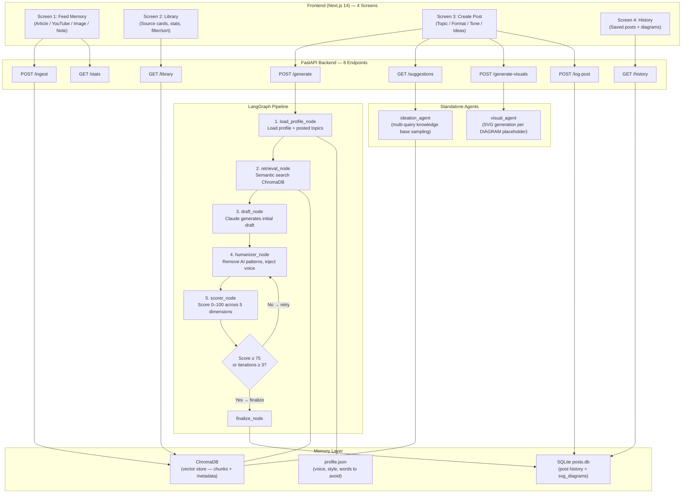

# Contendo

A personal content generation system that learns your knowledge base and writes in your voice. You feed it articles, YouTube videos, images, and notes — it stores them as semantic memory. When you want to publish, it retrieves the most relevant knowledge, drafts content in your style, humanizes it, scores it, and hands you a final editable post.

Built for a single user. No auth, no bloat — just a fast loop from raw knowledge to publishable content.

---

## Architecture



---

## The Four Screens

**Screen 1 — Feed Memory (`/`):** The user selects an input type (Article/Text, YouTube, Image, or Manual Note), pastes or uploads their content, and clicks "Add to memory." For images, Claude vision extracts the knowledge as text first. For all types, the content is chunked into 500-word overlapping segments, embedded locally with `sentence-transformers`, and upserted into ChromaDB. The response shows how many chunks were stored and what tags were auto-extracted. The YouTube tab shows a textarea for manual paste — auto-fetching was removed after YouTube blocked bot-based transcript retrieval.

**Screen 2 — Library (`/library`):** Shows everything the user has fed into memory, grouped by source (one card per ingest call, not per chunk). A stats bar shows total sources, total chunks, and unique tag count. Source cards display the type badge (Article/Note/Image/YouTube), title derived from the first 80 characters of the content, date added, chunk count, and tag pills. Filterable by source type, sortable newest/oldest. This gives the user full visibility into what knowledge the system has before generating a post.

**Screen 3 — Create Post (`/create`):** The user enters a topic, picks a format (LinkedIn Post, Medium Article, or Thread), sets a tone (Casual, Technical, or Storytelling), optionally adds context, and clicks "Generate." Before generating, "Get Ideas" runs multi-query diversity sampling across the full knowledge base and returns 8 fresh content suggestions the user can use or dismiss. The backend runs the full LangGraph pipeline — retrieving relevant knowledge, drafting in the user's voice, humanizing, and scoring. The final post appears in an editable textarea alongside an authenticity score (0–100) and specific feedback. "Generate visuals" parses `[DIAGRAM:]` and `[IMAGE:]` placeholders and generates SVGs via Claude. "Save to history" saves the post and any generated diagrams explicitly — nothing is auto-saved. Session state (post, score, visuals) persists in sessionStorage so navigating away and back restores the last session.

**Screen 4 — History (`/history`):** All explicitly saved posts, newest first. Each card shows topic, format/tone badges, authenticity score, and date. Clicking "See full post" expands the card to show the full text with a Copy button. If SVG diagrams were saved alongside the post, they are rendered inline in the expanded view with an "Open as PNG" button.

---

## Agent Pipeline

| Step | Agent | Job |
|------|-------|-----|
| 1 | `load_profile_node` | Reads `profile.json`, injects user voice and style into state. Also loads all previously posted topics from SQLite to prevent repeated angles. |
| 2 | `retrieval_node` | Queries ChromaDB for the 8 most semantically relevant chunks; filters out anything below 0.3 cosine similarity |
| 3 | `draft_node` | Calls Claude to produce an initial draft using the user profile, retrieved chunks, format-specific instructions, and mandatory visual placeholder rules |
| 4 | `humanizer_node` | Calls Claude to strip AI writing patterns, vary sentence structure, and inject the user's authentic voice |
| 5 | `scorer_node` | Calls Claude to score the draft 0–100 across 5 dimensions; uses 3-attempt JSON parse to handle markdown-wrapped responses |
| 6 | Conditional | If score ≥ 75 or iterations ≥ 3: finalize. Otherwise: loop back to humanizer |

---

## Tech Stack

| Layer | Tool | Why |
|-------|------|-----|
| Frontend | Next.js 14 (App Router) | File-based routing, RSC-ready, deploys instantly to Vercel |
| Styling | TailwindCSS | Utility-first, zero config, great with Next.js |
| Backend | FastAPI (Python 3.11) | Async, typed, auto-docs, fast iteration |
| LLM | claude-sonnet-4-6 (Anthropic) | Best balance of quality and speed for generation tasks |
| Embeddings | sentence-transformers (all-MiniLM-L6-v2) | Local, no API key, good semantic quality for retrieval |
| Vector DB | ChromaDB | Local persistent storage, simple Python API, no infra needed |
| Agent orchestration | LangGraph | Stateful graph with conditional edges — perfect for retry loops |
| Post history | SQLite (sqlite3) | Zero-config, single-file, sufficient for one user |
| Deployment (frontend) | Vercel | Native Next.js hosting |
| Deployment (backend) | Railway or Render | Simple Python service hosting |

---

## Local Development Setup

```bash
# 1. Clone the repo
git clone <repo-url>
cd <project-root>

# 2. Create and activate the Python virtual environment
python3 -m venv backend/venv
source backend/venv/bin/activate

# 3. Install Python dependencies
pip install -r backend/requirements.txt

# 4. Configure environment variables
cp backend/.env.example backend/.env
# Open backend/.env and fill in your ANTHROPIC_API_KEY

# 5. Start the backend (from project root, venv must be active)
cd backend
uvicorn main:app --reload

# 6. In a new terminal, start the frontend
cd frontend
npm install
npm run dev

# 7. Open the app
# http://localhost:3000
```

---

## Project File Structure

```
.
├── README.md                         # This file — project overview and architecture
├── CODEBASE.md                       # Full technical reference — read before touching code
├── PROMPTS.md                        # All agent system prompts verbatim — source of truth
├── .gitignore                        # Excludes venv, node_modules, .env, chroma data
│
├── frontend/
│   ├── app/
│   │   ├── layout.tsx                # Root layout — nav bar for all four screens
│   │   ├── globals.css               # Global styles — Tailwind directives, light theme
│   │   ├── page.tsx                  # Screen 1: Feed Memory (/)
│   │   ├── library/
│   │   │   └── page.tsx              # Screen 2: Library (/library)
│   │   ├── create/
│   │   │   └── page.tsx              # Screen 3: Create Post (/create)
│   │   └── history/
│   │       └── page.tsx              # Screen 4: History (/history)
│   ├── components/
│   │   ├── FeedMemory.tsx            # Feed Memory form — input types, submit, feedback
│   │   └── CreatePost.tsx            # Create Post — topic, format, tone, ideas, visuals, output
│   ├── .env.local                    # Sets NEXT_PUBLIC_API_URL=http://localhost:8000
│   ├── tailwind.config.ts            # Tailwind config scoped to app/ and components/
│   └── package.json                  # Next.js 14 + TypeScript + Tailwind
│
└── backend/
    ├── main.py                       # FastAPI app — all 8 routes + CORS config
    ├── requirements.txt              # All Python dependencies pinned
    ├── .env.example                  # Required env var keys with no values
    ├── agents/
    │   ├── ingestion_agent.py        # Chunks, tags, upserts content into ChromaDB
    │   ├── vision_agent.py           # Sends images to Claude vision for text extraction
    │   ├── visual_agent.py           # Parses [DIAGRAM:]/[IMAGE:] placeholders; generates SVGs
    │   ├── ideation_agent.py         # Multi-query diversity sampling + idea generation
    │   ├── retrieval_agent.py        # Semantic search node in the LangGraph pipeline
    │   ├── draft_agent.py            # Generates initial draft via Claude
    │   ├── humanizer_agent.py        # Rewrites draft to remove AI patterns
    │   └── scorer_agent.py           # Scores draft 0–100, robust JSON parse with fallback
    ├── pipeline/
    │   ├── state.py                  # TypedDict defining shared LangGraph pipeline state
    │   └── graph.py                  # LangGraph graph — nodes, edges, conditional retry
    ├── memory/
    │   ├── vector_store.py           # ChromaDB init, upsert, semantic query, get_all_sources
    │   ├── profile_store.py          # profile.json load/save with defaults auto-created
    │   └── feedback_store.py         # SQLite posts table — log_post, history, topics posted
    ├── tools/
    │   └── __init__.py               # Empty — tools directory retained for future use
    ├── utils/
    │   ├── chunker.py                # 500-word chunks with 50-word overlap
    │   └── formatters.py             # Format + tone instruction strings per output type
    └── data/
        └── profile.json              # User voice + style profile (auto-created if missing)
```

---

## Documentation Guide

Two files exist at the project root specifically for developer and AI-assistant onboarding:

**`CODEBASE.md`** — the complete technical reference for this system. It contains every file's purpose, all agent input/output contracts, all API endpoint shapes, all data schemas, every architectural decision made and why, and an explicit list of what is not yet built. Any developer or AI assistant starting a new session should read this file before touching any code.

**`PROMPTS.md`** — the single source of truth for every agent's behaviour. It contains each agent's system prompt verbatim, the variables injected into each prompt, and the scorer's full rubric. When any prompt needs tuning, update `PROMPTS.md` first, then update the corresponding agent file to match. These two must never be out of sync.
