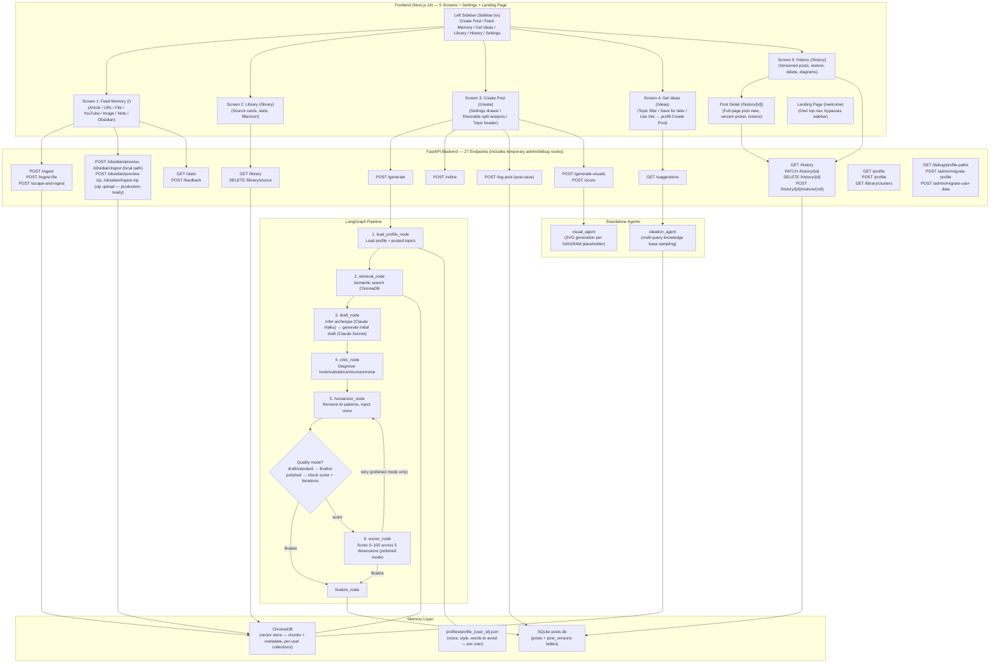

# Contendo

A personal content generation system that learns your knowledge base and writes in your voice. You feed it articles, YouTube videos, images, and notes — it stores them as semantic memory. When you want to publish, it retrieves the most relevant knowledge, drafts content in your style, humanizes it, scores it, and hands you a final editable post.

Built for authenticated multi-user usage with per-user data isolation (Clerk + namespaced memory stores) and a fast loop from raw knowledge to publishable content.

---

## Architecture



---

## The Five Screens + Settings

Navigation is handled by a persistent left sidebar (`Sidebar.tsx`), rendered by `AppShell.tsx` for every route except `/welcome`, `/first-post`, `/onboarding`, `/sign-in`, and `/sign-up`. The landing page at `/welcome` has its own top nav and bypasses the sidebar entirely. **`/welcome` is the default entry point and is accessible to all users** — unauthenticated visitors hitting the root URL are redirected there by `middleware.ts`; signed-in users can also visit `/welcome` at any time (e.g. via the sidebar logo link) and see auth-aware CTAs ("Open workspace" instead of sign-up prompts). Clicking "Log in" on the landing page preserves `/welcome` as the post-login destination via `redirect_url`.

**Screen 1 — Feed Memory (`/`):** The user selects an input type (Article/Text, URL, File, YouTube, Image/Diagram, Note, or Obsidian vault) and adds their content. For **URL**, the backend scrapes the page via Jina Reader and stores it automatically. For **File**, PDF, DOCX, and TXT uploads (up to 10 MB) are accepted — text is extracted server-side. For **Image/Diagram**, Claude vision extracts the knowledge as text first. For **Obsidian**, the user enters their local vault folder path; a preview step shows how many notes and words will be ingested before committing. The YouTube tab shows a textarea for manual paste — auto-fetching was removed after YouTube blocked bot-based transcript retrieval. For all types, content is chunked into 500-word overlapping segments, embedded locally with `sentence-transformers`, and upserted into ChromaDB. The response shows how many chunks were stored and what tags were auto-extracted.

**Screen 2 — Library (`/library`):** Shows everything the user has fed into memory, grouped by source (one card per ingest call, not per chunk). A stats bar shows total sources, total chunks, and unique tag count. Source cards display the type badge (Article/Note/Image/YouTube), title derived from the first 80 characters of the content, date added, chunk count, and tag pills. Searchable by title and tags, filterable by source type, sortable newest/oldest. This gives the user full visibility into what knowledge the system has before generating a post.

**Screen 3 — Create Post (`/create`):** The user enters a topic, picks format/tone/length, and clicks Generate. Before generation, all settings are shown inline. After generation, the settings form is replaced by the generated post in an editable textarea, with a small topic header displayed above the post. A "View authenticity analysis" toggle reveals the score panel; when open on wide viewports (≥ 900px), the layout switches to a split screen — post on the left, score and refine controls on the right — escaping the normal max-width container to use the full viewport beside the sidebar. The split ratio is resizable with a draggable divider and defaults to a 75/25 post-to-analysis balance when opened. The settings drawer (opened via "Regenerate") lets the user edit topic/format/tone/length/context and re-run without losing the current post. "Generate visuals" parses `[DIAGRAM:]` and `[IMAGE:]` placeholders and generates SVGs via Claude. Posts are **auto-saved** to history immediately after generation with a realtime tracking indicator ("Saved just now") — no manual save step required. Session state (post, score, visuals, ideas, length) persists in sessionStorage so navigating away and back restores the last session cleanly on the editor view.

**Screen 4 — Get Ideas (`/ideas`):** A dedicated brainstorm screen. The user optionally enters a topic focus and picks how many ideas to generate (3–15). The ideation agent runs multi-query diversity sampling across the knowledge base and returns content suggestions. Ideas generated in a session persist in localStorage (`contendo_ideas`) and are restored on page revisit. Individual ideas can be saved for later (`contendo_saved_ideas` localStorage key); saved ideas appear in a "SAVED" subsection. Clicking "Use this" writes the idea title to `contentOS_last_topic` and the format to `contentOS_prefill_format` in sessionStorage, then redirects to Create Post where both are pre-filled.

**Screen 5 — History (`/history`):** All auto-saved posts, newest first. Searchable by topic and content string matches. Each card shows topic, format/tone badges, authenticity score, and date. Every generation creates version 1; every refinement creates the next version. Version pills in the card header show the score for each version (color-coded green/amber/red) with the best version starred. Clicking a pill switches the expanded view to that version's content. Any version can be restored to Create Post with one click. Cards can be deleted with a confirmation step. Global toast notifications pop up confirming system interactions. If SVG diagrams were saved alongside the post, they are rendered inline in the expanded view with an "Open as PNG" button. Individual posts also have a dedicated full-page detail view at `/history/[id]`.

**Settings (`/settings`):** Settings hub page accessible from the sidebar. Shows 6 cards in a 2-column grid: **Profile** (avatar, name, role, bio excerpt), **Voice & Fingerprint** (counts for phrases/avoid/rules/topics), **Writing Samples** (sample count + nudge), **Memory** (knowledge chunk count, links to Library), **Account** (Clerk email, sign-out), and **Integrations** (coming soon). Loads profile and stats in parallel with skeleton placeholders while fetching.

**Edit Profile (`/settings/profile`):** Full profile editor linked from the Settings hub. Structured into six anchored card sections (Identity, Audience, Voice, Opinions, Samples, Advanced) with a sticky section nav for fast navigation. A live-updating profile summary header (avatar initials, name, role, location) sits above the form. All fields from onboarding are editable. A sticky "Save changes" button shows an amber dot when dirty; saves via `POST /profile`; shows success/error toast. Browser `beforeunload` guard fires if navigating away with unsaved changes.

---

## Agent Pipeline

| Step | Agent | Job |
|------|-------|-----|
| 1 | `load_profile_node` | Reads `profile.json`, injects user voice and style into state. Also loads all previously posted topics from SQLite to prevent repeated angles. |
| 2 | `retrieval_node` | Queries ChromaDB for the 8 most semantically relevant chunks; builds a `retrieval_bundle` with source summaries and adjacent sibling chunks from `hierarchy_store`; sets `retrieved_context` (enriched prompt block) and always sets `retrieved_chunks` for backward compat; computes internal retrieval calibration fields (`retrieval_confidence`, `retrieved_chunk_count`) from raw retrieval results; falls back to flat retrieval if hierarchy_store is empty |
| 3 | `draft_node` | First calls Claude Haiku (`infer_archetype()`) to classify the topic into one of 7 post archetypes. Then calls Claude Sonnet to produce a draft using the enriched `retrieved_context` (source summaries + sibling chunks for top sources) or flat `retrieved_chunks` as fallback; injects a dynamic `grounding_instruction` for medium/low retrieval confidence and injects nothing for high confidence (baseline behavior unchanged) |
| 4 | `critic_node` | Calls Claude Haiku once to diagnose hook/substance/structure/voice issues and writes `critic_brief` into state |
| 5 | `humanizer_node` | Calls Claude to strip AI writing patterns, vary sentence structure, inject the user's authentic voice, and apply `critic_brief` fixes when present. Also exposes `refine_draft()` for targeted post-generation edits via `/refine` |
| 6 | `scorer_node` | Calls Claude to score the draft 0–100 across 5 dimensions; uses 3-attempt JSON parse to handle markdown-wrapped responses |
| 7 | Conditional | **draft** mode: skip critic, humanizer, and scorer entirely, return raw draft. **standard** mode (default): critic + 1 humanizer pass; scorer skipped during generation — scored lazily on demand via `POST /score` when user clicks the analysis toggle. **polished** mode: critic + up to 3 humanizer passes with scorer running each iteration; retries if score < 75 and iterations < 3. |

---

## Tech Stack

| Layer | Tool | Why |
|-------|------|-----|
| Frontend | Next.js 14 (App Router) | File-based routing, RSC-ready, deploys instantly to Vercel |
| Styling | TailwindCSS | Utility-first, zero config, great with Next.js |
| Font | Noto Serif + Inter (Google Fonts) | Noto Serif for headlines (`font-headline`), Inter for body/UI — loaded via `@import` in `globals.css`; editorial atelier aesthetic |
| Backend | FastAPI (Python 3.11) | Async, typed, auto-docs, fast iteration |
| LLM | claude-sonnet-4-6 (Anthropic) | Best balance of quality and speed for generation tasks |
| Embeddings | sentence-transformers (all-MiniLM-L6-v2) | Local, no API key, good semantic quality for retrieval |
| Vector DB | ChromaDB | Local persistent storage, simple Python API, no infra needed |
| Agent orchestration | LangGraph | Stateful graph with conditional edges — perfect for retry loops |
| Post history | SQLite (sqlite3) | Zero-config, single-file, sufficient for one user |
| HTTP client | httpx | URL scraping via Jina Reader |
| PDF extraction | PyMuPDF (fitz) | Fast text extraction from PDFs; detects scanned/image-only files |
| DOCX extraction | python-docx | Plain text extraction from Word documents |
| Deployment (frontend) | Vercel | Native Next.js hosting |
| Deployment (backend) | Railway or Render | Simple Python service hosting |

---

## Local Development Setup

```bash
# 1. Clone the repo
git clone <repo-url>
cd <project-root>

# 2. Create and activate the Python virtual environment
python3 -m venv backend/venv
source backend/venv/bin/activate

# 3. Install Python dependencies
pip install -r backend/requirements.txt

# 4. Configure environment variables
cp backend/.env.example backend/.env
# Open backend/.env and fill in your ANTHROPIC_API_KEY

# 5. Start the backend (from project root, venv must be active)
cd backend
uvicorn main:app --reload

# 6. In a new terminal, start the frontend
cd frontend
npm install
npm run dev

# 7. Open the app
# http://localhost:3000
```

---

## Setup your profile

The system writes in YOUR voice — but it needs to know who you are first.

**Production (Vercel + Railway):** Sign up at the app URL. New users are automatically redirected to `/first-post` — a guided first-draft flow that captures profile signals and generates a first post. After that, they can move into the main workspace. `/onboarding` remains as a backward-compatible route that immediately redirects to `/first-post`.

**Local dev:** The same first-post flow works locally. Profiles are saved to `backend/data/profiles/profile_{user_id}.json` (or `backend/data/profile.json` for the legacy `user_id=default` fallback when no auth token is present).

The more specific you are, the better the output. Generic profile → generic posts. Specific profile → posts that sound like you wrote them.

Note: profile files are gitignored — your personal details never get committed.

---

## Project File Structure

```
.
├── README.md                         # This file — project overview and architecture
├── CODEBASE.md                       # Full technical reference — read before touching code
├── PROMPTS.md                        # All agent system prompts verbatim — source of truth
├── DESIGN.md                         # Editorial Atelier design system — read before any UI change
├── scripts/
│   └── migrate_hierarchy.py          # One-time migration: backfill hierarchy_store from existing ChromaDB data
├── .gitignore                        # Excludes venv, node_modules, .env, chroma data
│
├── frontend/
│   ├── app/
│   │   ├── layout.tsx                # Root layout — mounts AppShell (sidebar + main content area)
│   │   ├── globals.css               # Global styles — Tailwind directives, warm cream palette
│   │   ├── page.tsx                  # Screen 1: Feed Memory (/)
│   │   ├── library/
│   │   │   └── page.tsx              # Screen 2: Library (/library)
│   │   ├── create/
│   │   │   └── page.tsx              # Screen 3: Create Post (/create)
│   │   ├── ideas/
│   │   │   └── page.tsx              # Screen 4: Get Ideas (/ideas)
│   │   ├── history/
│   │   │   ├── page.tsx              # Screen 5: History (/history)
│   │   │   └── [id]/
│   │   │       └── page.tsx          # Post detail (/history/[id])
│   │   └── welcome/
│   │       └── page.tsx              # Landing page (/welcome) — own top nav, no sidebar
│   ├── app/
│   │   ├── onboarding/
│   │   │   └── page.tsx              # Legacy route — immediately redirects to /first-post
│   │   ├── first-post/
│   │   │   └── page.tsx              # New-user guided first-post flow
│   │   └── settings/
│   │       ├── page.tsx              # Settings hub (/settings) — 6 cards: Profile, Voice, Samples, Memory, Account, Integrations
│   │       └── profile/
│   │           └── page.tsx          # Profile editor (/settings/profile) — section nav, summary header, sticky save
│   ├── components/
│   │   ├── AppShell.tsx              # Layout wrapper — sidebar for app routes, passthrough for /welcome + /first-post + /onboarding
│   │   ├── Sidebar.tsx               # Left sidebar — logo, six nav items (+ Settings), user row
│   │   ├── FeedMemory.tsx            # Feed Memory form — all input types, Obsidian vault flow
│   │   ├── CreatePost.tsx            # Create Post — 4-state UI, settings drawer, resizable split-screen analysis
│   │   └── ui/
│   │       ├── TagInput.tsx          # Shared tag pill input — used by onboarding + settings
│   │       └── ToastProvider.tsx     # Global toast notifications context
│   ├── .env.local                    # Sets NEXT_PUBLIC_API_URL=http://localhost:8000
│   ├── tailwind.config.ts            # Tailwind config scoped to app/ and components/
│   └── package.json                  # Next.js 14 + TypeScript + Tailwind
│
└── backend/
    ├── main.py                       # FastAPI entry point — CORS, lifespan, router registration, logging config
    ├── routers/
    │   ├── ingest.py                 # /ingest, /ingest-file, /scrape-and-ingest, /obsidian/*
    │   ├── generate.py               # /generate, /refine, /score, /generate-visuals
    │   ├── history.py                # /history, /log-post, PATCH/DELETE/restore history
    │   ├── library.py                # /library, DELETE /library/source
    │   ├── ideas.py                  # /suggestions
    │   ├── stats.py                  # /stats
    │   ├── profile.py                # GET/POST /profile — per-user read/write, read-back verification
    │   ├── debug.py                  # TEMPORARY: GET /debug/profile-paths (no auth)
    │   └── admin.py                  # TEMPORARY: POST /admin/migrate-profile + POST /admin/migrate-user-data (x-migration-secret)
    ├── requirements.txt              # All Python dependencies pinned
    ├── .env.example                  # Required env var keys with no values
    ├── agents/
    │   ├── ingestion_agent.py        # Chunks, tags, upserts content into ChromaDB
    │   ├── vision_agent.py           # Sends images to Claude vision for text extraction
    │   ├── visual_agent.py           # Parses [DIAGRAM:]/[IMAGE:] placeholders; generates SVGs
    │   ├── ideation_agent.py         # Multi-query diversity sampling + idea generation
    │   ├── retrieval_agent.py        # Semantic search node in the LangGraph pipeline
    │   ├── draft_agent.py            # Generates initial draft via Claude + confidence-based grounding calibration
    │   ├── humanizer_agent.py        # Rewrites draft to remove AI patterns; exposes refine_draft()
    │   └── scorer_agent.py           # Scores draft 0–100, robust JSON parse with fallback
    ├── pipeline/
    │   ├── state.py                  # TypedDict defining shared LangGraph pipeline state
    │   └── graph.py                  # LangGraph graph — nodes, edges, quality-aware routing; returns retrieval_confidence in /generate output
    ├── memory/
    │   ├── vector_store.py           # ChromaDB init, upsert, semantic query, get_all_sources, get_adjacent_chunks; per-user collections namespaced as contendo_{user_id}
    │   ├── hierarchy_store.py        # SQLite hierarchy.db — source_nodes + topic_nodes for hierarchical retrieval
    │   ├── profile_store.py          # profile.json load/save with defaults auto-created
    │   └── feedback_store.py         # SQLite posts + post_versions tables — history, versions, restore
    ├── tools/
    │   ├── scraper_tool.py           # URL scraper via Jina Reader — scrape_url(), clean_scraped_text()
    │   └── obsidian_tool.py          # Obsidian vault reader — read_vault(), get_vault_stats(), clean_obsidian_markdown()
    ├── utils/
    │   ├── chunker.py                # 500-word chunks with 50-word overlap
    │   ├── formatters.py             # Format + tone instruction strings per output type
    │   └── file_extractor.py         # PDF (PyMuPDF), DOCX (python-docx), TXT text extraction
    └── data/
        ├── profile.template.json     # Committed template — copy to profile.json to get started
        └── profile.json              # User voice + style profile (gitignored, auto-created if missing)
```

---

## Production Deployment

### Stack
- **Frontend** → Vercel
- **Backend** → Railway (Docker, persistent volume for data)

---

### 1 — Local Development (unchanged)

```bash
# Backend
cd backend
source venv/bin/activate
uvicorn main:app --reload          # http://localhost:8000

# Frontend (separate terminal)
cd frontend
npm run dev                        # http://localhost:3000
```

No extra env vars needed. `DATA_DIR` defaults to `backend/data/`.

---

### 2 — Backend Deployment to Railway

1. Push this repo to GitHub (or connect Railway to an existing repo).
2. In Railway, create a **New Service → GitHub repo**, set the **Root Directory** to `backend/`.
3. Railway auto-detects the `Dockerfile` — no extra config needed.
4. Set the following environment variables in Railway's dashboard:

| Variable | Value |
|----------|-------|
| `ANTHROPIC_API_KEY` | Your Anthropic key |
| `DATA_DIR` | `/data` |
| `ENVIRONMENT` | `production` |
| `FRONTEND_ORIGIN` | `https://your-app.vercel.app` (exact Vercel URL) |

Railway injects `$PORT` automatically — the `CMD` in the Dockerfile uses it.

> **First cold-start note:** the `all-MiniLM-L6-v2` embedding model (~90 MB) is downloaded from Hugging Face on first use, not baked into the Docker image. This keeps Railway build times fast. The model is cached by `sentence-transformers` inside the container after the first download. Expect the very first request that triggers embedding (any ingest or generate call) to take an extra 20–30 seconds. Subsequent restarts reuse the cache.

---

### 3 — Railway Persistent Volume Setup

1. In Railway, open your backend service → **Volumes** → **Add Volume**.
2. Set the mount path to `/data`.
3. Railway will persist everything written to `/data` across deploys.

> Your data files live at the top level of the volume:
> - `/data/chroma_db/` — ChromaDB vector store directory
> - `/data/posts.db` — post history SQLite database
> - `/data/hierarchy.db` — hierarchy store SQLite database
> - `/data/profiles/profile_{user_id}.json` — per-user voice and style profiles (created by first-post flow or profile save)
> - `/data/profile.json` — legacy single-user profile (still read for `user_id=default` in local dev)

---

### 4 — Migrating Existing Local Data to Railway

Do this once before your first production deploy.

**Files to copy from your local machine:**

```
backend/data/chroma_db/        →  /data/chroma_db/
backend/data/posts.db          →  /data/posts.db
backend/data/hierarchy.db      →  /data/hierarchy.db
backend/data/profile.json      →  /data/profile.json
```

**How to migrate via the temporary migration endpoints in `backend/routers/admin.py`:**

Two endpoints handle the migration. Run them in order after the backend is deployed and the persistent volume is mounted:

```bash
# 1. Migrate ChromaDB chunks, SQLite posts, and hierarchy nodes
#    (copies everything under user_id="default" to your Clerk user ID)
curl -X POST https://your-service.up.railway.app/admin/migrate-user-data \
  -H "Content-Type: application/json" \
  -H "x-migration-secret: YOUR_MIGRATION_SECRET" \
  -d '{"target_user_id": "your_clerk_user_id"}'

# 2. Migrate your voice/style profile
curl -X POST https://your-service.up.railway.app/admin/migrate-profile \
  -H "Content-Type: application/json" \
  -H "x-migration-secret: YOUR_MIGRATION_SECRET" \
  -d '{"target_user_id": "your_clerk_user_id"}'
```

**Verify the migration:**

After running both curls, sign in to the app and confirm: Library shows all existing sources, History shows all existing posts, Stats shows a non-zero chunk count, and `/settings` shows your profile name.

---

### 5 — Frontend Deployment to Vercel

1. Import the GitHub repo into Vercel.
2. Set **Root Directory** to `frontend/`.
3. Set the following environment variable in Vercel's dashboard:

| Variable | Value |
|----------|-------|
| `NEXT_PUBLIC_API_URL` | `https://your-backend.up.railway.app` |

Vercel runs `npm run build` automatically. No other config needed.

---

### 6 — Obsidian Production Limitation

Obsidian vault ingestion reads directly from the local filesystem. It **cannot work** when the backend runs on a remote server (Railway).


 The Obsidian tab offers two ingestion modes:
 1. **Local path:** Read directly from your filesystem. Returns `400` on production (`ENVIRONMENT=production`) since remote servers can't access local files. Frontend shows a notice recommending zip upload on non-localhost deployments.
 2. **Upload zip:** Upload a `.zip` of your Obsidian vault. Works on both localhost and production. The `/obsidian/preview-zip` and `/obsidian/ingest-zip` endpoints have no environment guard and are production-ready.
---

### 7 — Post-Deploy Smoke Test Checklist

After deploying:

- [ ] `GET https://your-backend.up.railway.app/health` returns `{"status": "ok"}`
- [ ] `GET https://your-backend.up.railway.app/debug/profile-paths` shows `data_dir: "/data"` and `profiles_dir_exists: true`
- [ ] Frontend loads at your Vercel URL
- [ ] New user sign-up → redirected to `/first-post` and can complete first draft flow
- [ ] Sign out and sign back in → no forced onboarding loop (`/onboarding` redirects to `/first-post` only when visited)
- [ ] `/settings` loads with all profile fields populated
- [ ] **Library** screen shows your existing sources and chunk count
- [ ] **History** screen shows your existing posts
- [ ] **Create Post** → generate a post on a test topic — confirm it completes without error
- [ ] **Get Ideas** → generate a few ideas — confirm they draw from your knowledge base
- [ ] **Feed Memory** → ingest a test article — confirm chunks stored
- [ ] Obsidian tab is present on production with zip-upload flow (local path mode hidden)
- [ ] No CORS errors in browser DevTools console

---

## Documentation Guide

Two files exist at the project root specifically for developer and AI-assistant onboarding:

**`CODEBASE.md`** — the complete technical reference for this system. It contains every file's purpose, all agent input/output contracts, all API endpoint shapes, all data schemas, every architectural decision made and why, and an explicit list of what is not yet built. Any developer or AI assistant starting a new session should read this file before touching any code.

**`PROMPTS.md`** — the single source of truth for every agent's behaviour. It contains each agent's system prompt verbatim, the variables injected into each prompt, and the scorer's full rubric. When any prompt needs tuning, update `PROMPTS.md` first, then update the corresponding agent file to match. These two must never be out of sync.

**`DESIGN.md`** — the Editorial Atelier design system specification. Defines the full colour palette (Material Design tokens), typography rules (Noto Serif headlines + Inter body), the No-Line Rule, surface hierarchy, elevation model, and component specs for buttons, inputs, and cards. Mandatory reading before any frontend UI/UX change.
