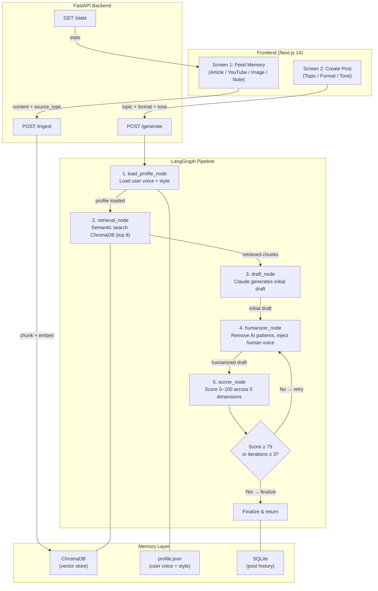

# Contendo

A personal content generation system that learns your knowledge base and writes in your voice. You feed it articles, YouTube videos, images, and notes — it stores them as semantic memory. When you want to publish, it retrieves the most relevant knowledge, drafts content in your style, humanizes it, scores it, and hands you a final editable post.

Built for a single user. No auth, no bloat — just a fast loop from raw knowledge to publishable content.

---

## Architecture



---

## The Two Screens

**Screen 1 — Feed Memory:** The user selects an input type (Article/Text, YouTube URL, Image, or Manual Note), pastes or uploads their content, and clicks "Add to memory." Behind the scenes, the backend extracts the content (fetching YouTube transcripts automatically, or running Claude vision on images), chunks it into 500-word overlapping segments, embeds each chunk with `sentence-transformers`, and upserts them into ChromaDB. The response shows how many chunks were stored and what tags were auto-extracted from the content.

**Screen 2 — Create Post:** The user enters a topic, picks a format (LinkedIn Post, Medium Article, or Thread), sets a tone (Casual, Technical, or Storytelling), optionally adds context, and clicks "Generate." The backend runs the full LangGraph pipeline — retrieving the most semantically relevant knowledge, drafting in the user's voice, humanizing the output, and scoring it. The final post appears in an editable textarea alongside an authenticity score (0–100) and specific feedback. The user can copy the post or regenerate with a single click.

---

## Agent Pipeline

| Step | Agent | Job |
|------|-------|-----|
| 1 | `load_profile_node` | Reads `profile.json` and injects user voice, style rules, and writing preferences into pipeline state |
| 2 | `retrieval_node` | Queries ChromaDB for the 8 most semantically relevant chunks; filters out anything below 0.3 cosine similarity |
| 3 | `draft_node` | Calls Claude to produce an initial draft using the user profile, retrieved chunks, and format-specific instructions |
| 4 | `humanizer_node` | Calls Claude to strip AI writing patterns, vary sentence structure, and inject the user's authentic voice |
| 5 | `scorer_node` | Calls Claude to score the draft 0–100 across 5 dimensions and return flagged sentences |
| 6 | Conditional | If score ≥ 75 or iterations ≥ 3: finalize. Otherwise: loop back to humanizer |

---

## Tech Stack

| Layer | Tool | Why |
|-------|------|-----|
| Frontend | Next.js 14 (App Router) | File-based routing, RSC-ready, deploys instantly to Vercel |
| Styling | TailwindCSS | Utility-first, zero config, great with Next.js |
| Backend | FastAPI (Python 3.11) | Async, typed, auto-docs, fast iteration |
| LLM | claude-sonnet-4-6 (Anthropic) | Best balance of quality and speed for generation tasks |
| Embeddings | sentence-transformers (all-MiniLM-L6-v2) | Local, no API key, good semantic quality for retrieval |
| Vector DB | ChromaDB | Local persistent storage, simple Python API, no infra needed |
| Agent orchestration | LangGraph | Stateful graph with conditional edges — perfect for retry loops |
| YouTube transcripts | youtube-transcript-api | No API key, reliable, returns timestamped chunks |
| Post history | SQLite (sqlite3) | Zero-config, single-file, sufficient for one user |
| Deployment (frontend) | Vercel | Native Next.js hosting |
| Deployment (backend) | Railway or Render | Simple Python service hosting |

---

## Local Development Setup

```bash
# 1. Clone the repo
git clone <repo-url>
cd <project-root>

# 2. Create and activate the Python virtual environment
python3 -m venv backend/venv
source backend/venv/bin/activate

# 3. Install Python dependencies
pip install -r backend/requirements.txt

# 4. Configure environment variables
cp backend/.env.example backend/.env
# Open backend/.env and fill in your ANTHROPIC_API_KEY

# 5. Start the backend (from project root, venv must be active)
cd backend
uvicorn main:app --reload

# 6. In a new terminal, start the frontend
cd frontend
npm install
npm run dev

# 7. Open the app
# http://localhost:3000
```

---

## Project File Structure

```
.
├── README.md                         # This file — project overview and architecture
├── CODEBASE.md                       # Full technical reference — read before touching code
├── PROMPTS.md                        # All agent system prompts verbatim — source of truth
├── .gitignore                        # Excludes venv, node_modules, .env, chroma data
│
├── frontend/
│   ├── app/
│   │   ├── layout.tsx                # Root layout — shared shell for both screens
│   │   ├── page.tsx                  # Screen 1: Feed Memory (default route /)
│   │   └── create/
│   │       └── page.tsx              # Screen 2: Create Post (/create)
│   └── components/
│       ├── FeedMemory.tsx            # Feed Memory form — input types, submit, feedback
│       └── CreatePost.tsx            # Create Post form — topic, format, tone, output
│
└── backend/
    ├── main.py                       # FastAPI app — all routes + CORS config
    ├── config.py                     # Shared constants (score threshold, retry limit, etc.)
    ├── .env.example                  # Required env var keys with no values
    ├── requirements.txt              # All Python dependencies pinned
    ├── agents/
    │   ├── ingestion_agent.py        # Chunks, embeds, and upserts content into ChromaDB
    │   ├── vision_agent.py           # Sends images to Claude vision for text extraction
    │   ├── retrieval_agent.py        # Semantic search over ChromaDB, filters by relevance
    │   ├── draft_agent.py            # Generates initial draft via Claude
    │   ├── humanizer_agent.py        # Rewrites draft to remove AI patterns
    │   └── scorer_agent.py           # Scores draft 0–100, returns flagged sentences
    ├── pipeline/
    │   ├── state.py                  # TypedDict defining shared LangGraph pipeline state
    │   └── graph.py                  # LangGraph graph definition with conditional retry edge
    ├── memory/
    │   ├── vector_store.py           # ChromaDB init, upsert, and semantic query
    │   └── profile_store.py          # profile.json load/save with defaults auto-created
    ├── tools/
    │   └── youtube_tool.py           # Fetches and concatenates YouTube transcripts
    ├── utils/
    │   ├── chunker.py                # 500-word chunks with 50-word overlap
    │   └── formatters.py            # Format instruction strings per output type
    └── data/
        └── profile.json              # User voice + style profile (auto-created if missing)
```

---

## Documentation Guide

Two files exist at the project root specifically for developer and AI-assistant onboarding:

**`CODEBASE.md`** — the complete technical reference for this system. It contains every file's purpose, all agent input/output contracts, all API endpoint shapes, all data schemas, every architectural decision made and why, and an explicit list of what is not yet built. Any developer or AI assistant starting a new session should read this file before touching any code.

**`PROMPTS.md`** — the single source of truth for every agent's behaviour. It contains each agent's system prompt verbatim, the variables injected into each prompt, and the scorer's full rubric. When any prompt needs tuning, update `PROMPTS.md` first, then update the corresponding agent file to match. These two must never be out of sync.
